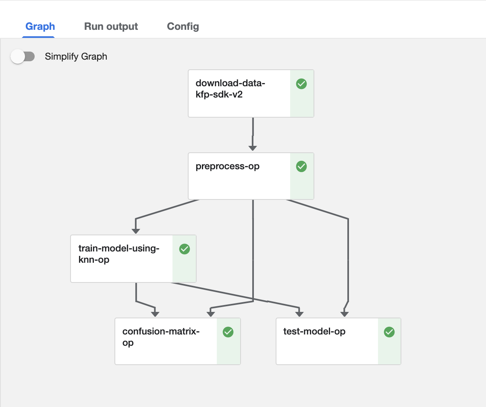

## Kubeflow Pipeline

### Prerequisites

- Python 3.6+

### Installation

A [virtualenv](https://packaging.python.org/guides/installing-using-pip-and-virtual-environments/) or similar tools to
create isolated Python environment is recommended.

1. Install `virtualenv`
   ```python
   pip3 install virtualenv
   ```

2. Set up ML Conversational Analytic Tool in a virtualenv
   ```python
   python3 -m venv venv-kubeflow
   ```

3. Activate the virtualenv
   ```python
   source ./venv-kubeflow/bin/activate
   ```

4. Install required python libraries and update pip
   ```python
   pip install kfp pandas scikit-learn minio --upgrade
   ```

### Examples

- [hello world](./hello-world)
    - [v1](./hello-world/hello-world-v1.py)
    - [v2 compatible](./hello-world/hello-world-v2.py)
- [iris](./iris)
    - [v1](./iris/iris-v1.py)
    - [v2 compatible](./iris/iris-v2.py)

### v2 Compatible Iris Pipeline Outcome
